# Schedulearn

***An Elastic Learning Platform Using Microservices***

Author: Bijon Setyawan Raya
Advisor: Che-Rung Lee

---

# Outline

* Introduction
* Motivation
* Background
* Design & Implementation
* Experimentation
* Conclusion
* Future Work

---

# Introduction

---

### Introduction

#### _Objectives_

* To implement a lightweight deep learning distributed scheduling system

* To implement different scheduling algorithms

* To implement job migrations

* To compare the performance of scheduling algorithms

---

### Introduction

#### _Contributions_

1. A lightweight deep learning scheduling system

2. A customizeable scheduling system

3. Implemented job migrations

---

# Motivation

---

# _Why Schedulearn?_

--- 

_Why Schedulearn?_

### 1. Monolithic systems are hard to customize and to scale.

---

_Why Schedulearn?_

### 2. Why use Kubernetes?

---

_Why Schedulearn?_

### 3. Why use Golang?

---

# Background

---

### Containerization

---

### Distributed Deep Learning

---

### Web Services

---

### Persistent Storage

---

# Design & Implementation

---

### System Overview

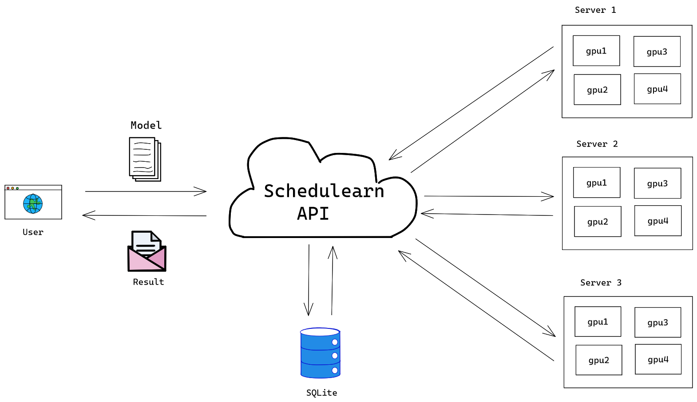

---

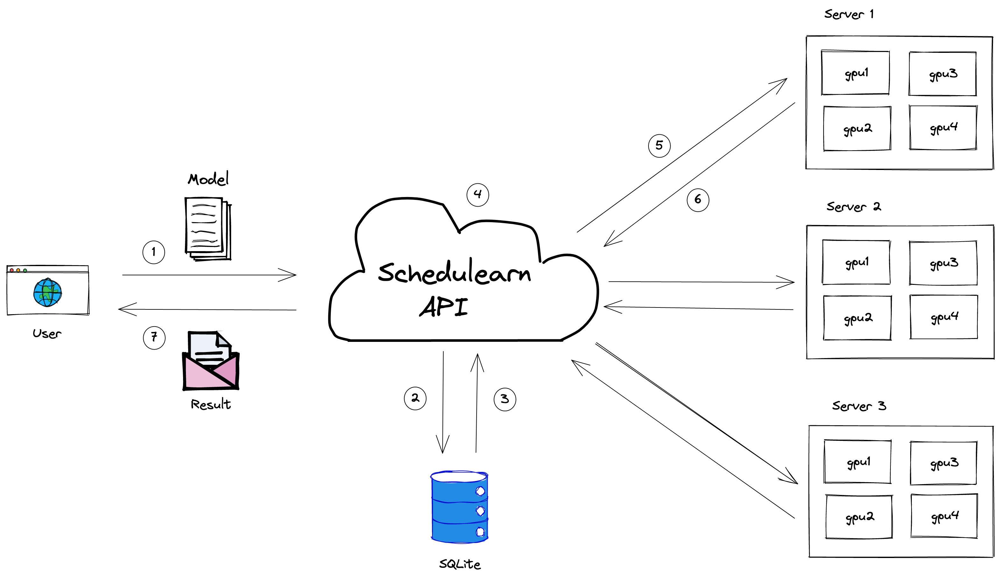

#### How Does It Work?
1. Send
2. Schedule
3. Store
4. Retrieve
5. Train
6. Return result
7. Send back

---

### FIFO

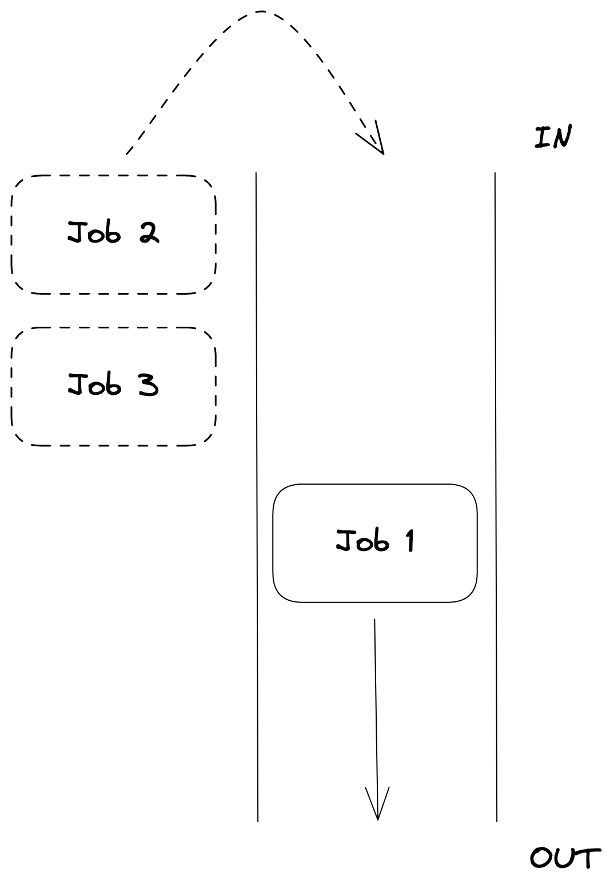

---

### Round Robin

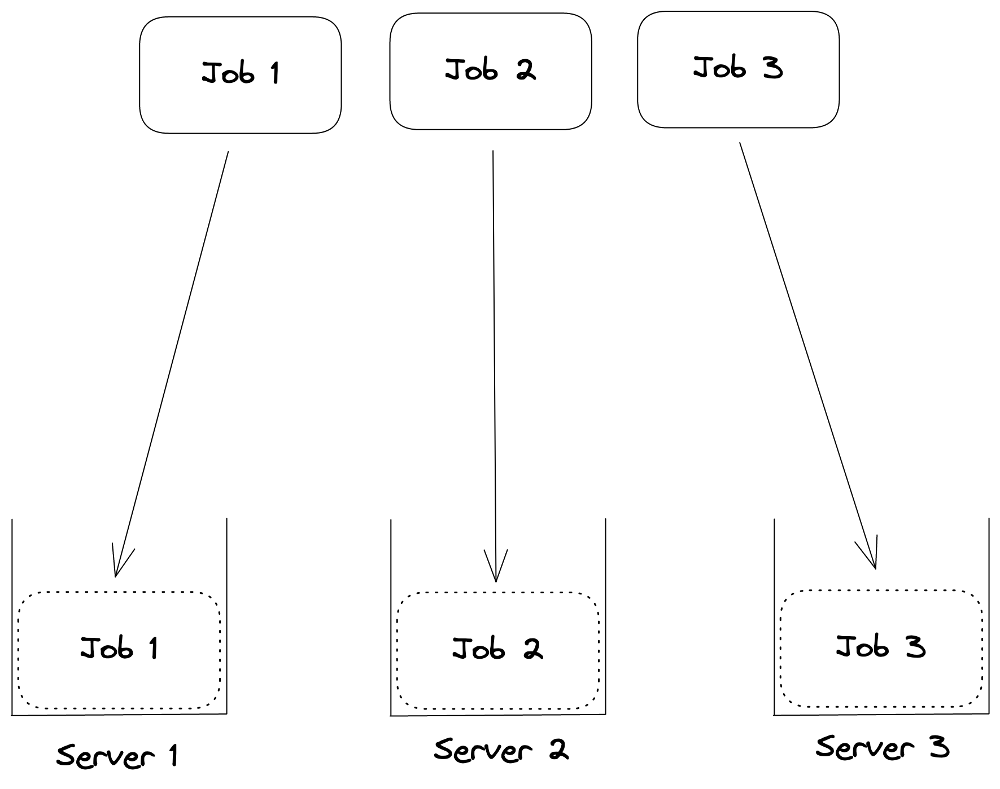

---

### Job Migrations

Kill + respawn

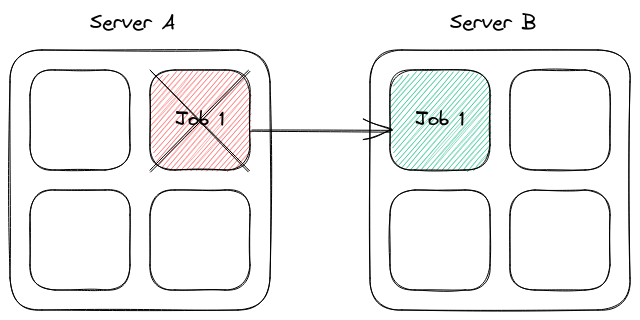

---

# Experimentation

---

### Testbed Specification

1. 4 x Nvidia 1080 Ti graphics cards
2. Intel Xeon E5-2678 v3, 48 cores
3. 128 GB RAM
4. 10G PCIe network

---

### Speedups

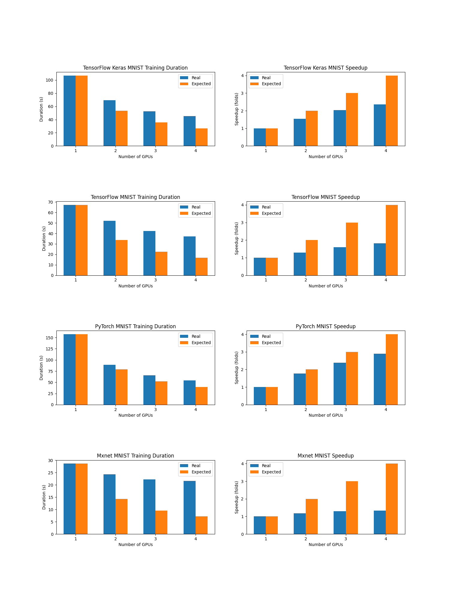

1. TensorFlow Keras MNIST
2. TensorFlow MNIST
3. PyTorch MNIST
4. Apache MXNet MNIST

---

### Scalability

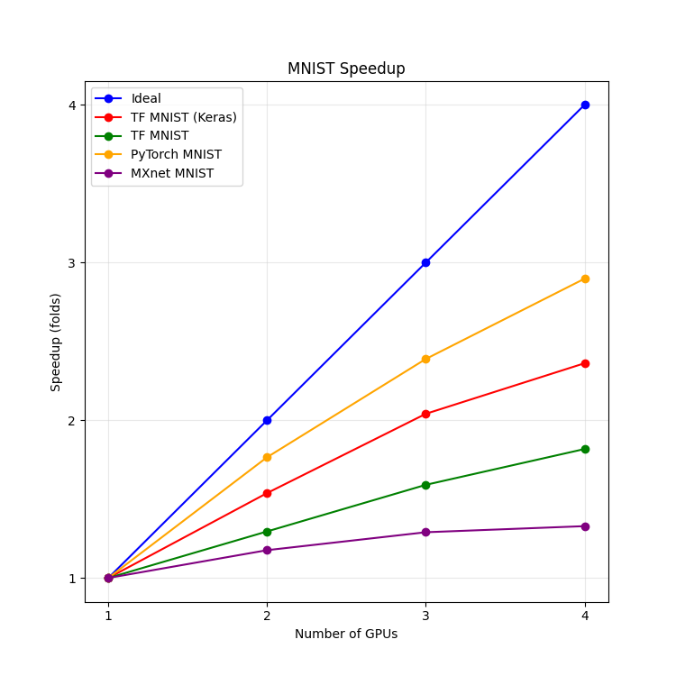

---

### Makespan & Turnaround Time

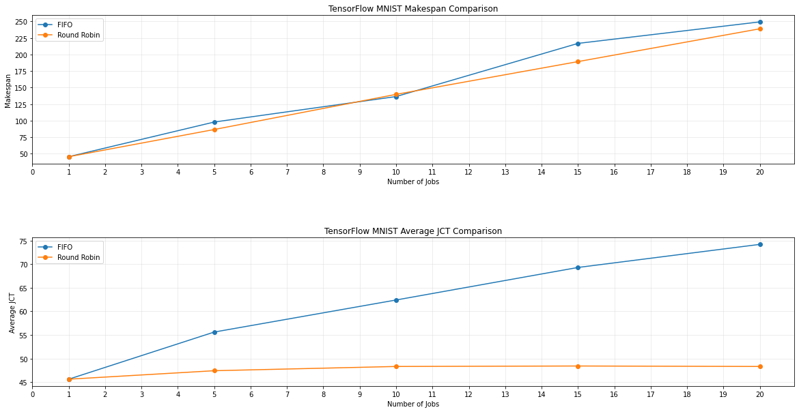

---

### Makespan & Turnaround Time

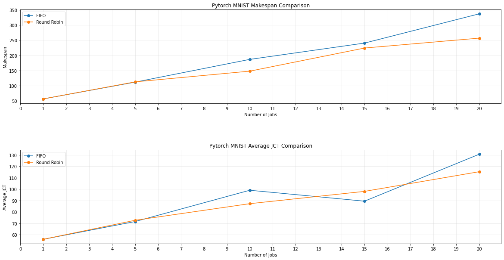

---

### Makespan & Turnaround Time

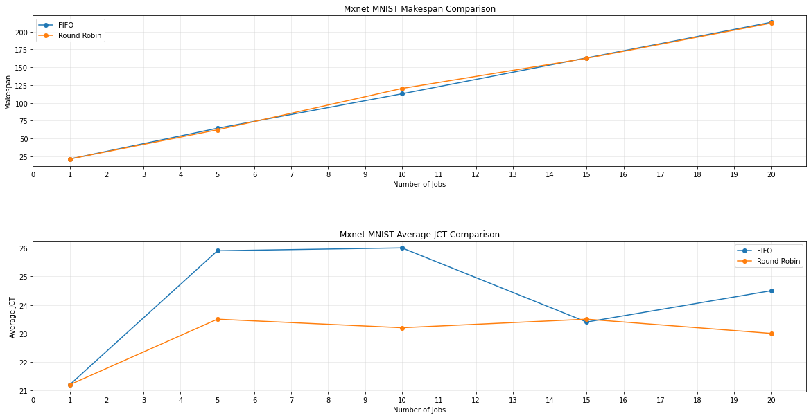

---

### Job Migrations

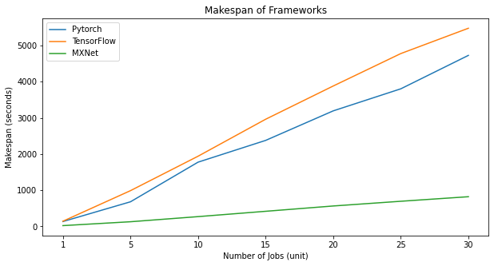

---

### Job Migrations

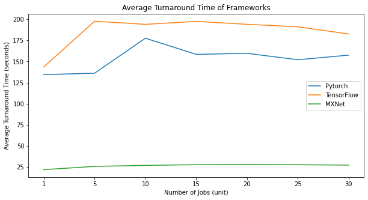

---

### Job Migrations

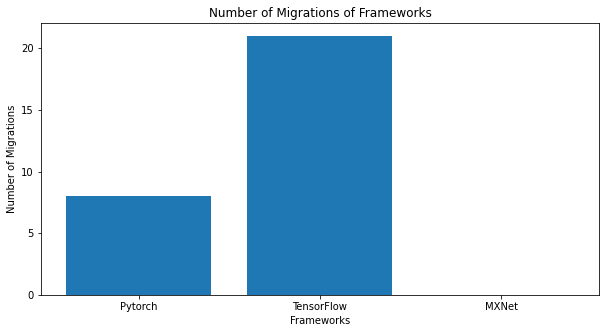

---

### FIFO + PyTorch

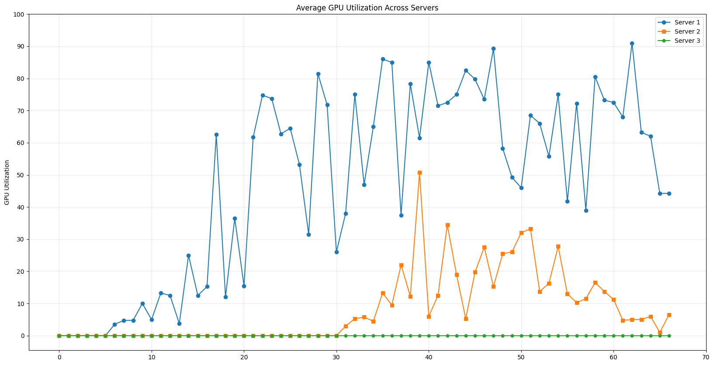

---

### FIFO + TensorFlow

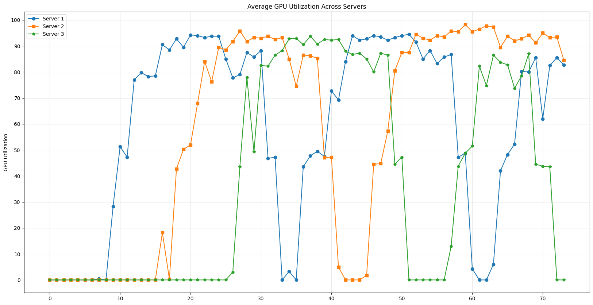

---

### FIFO + Apache MXNet

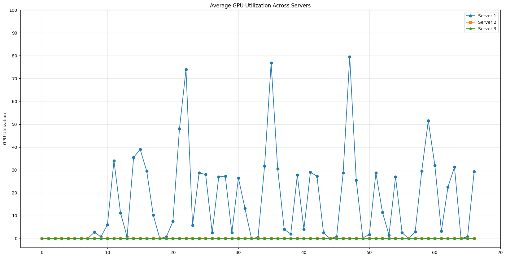

---

### RR + PyTorch

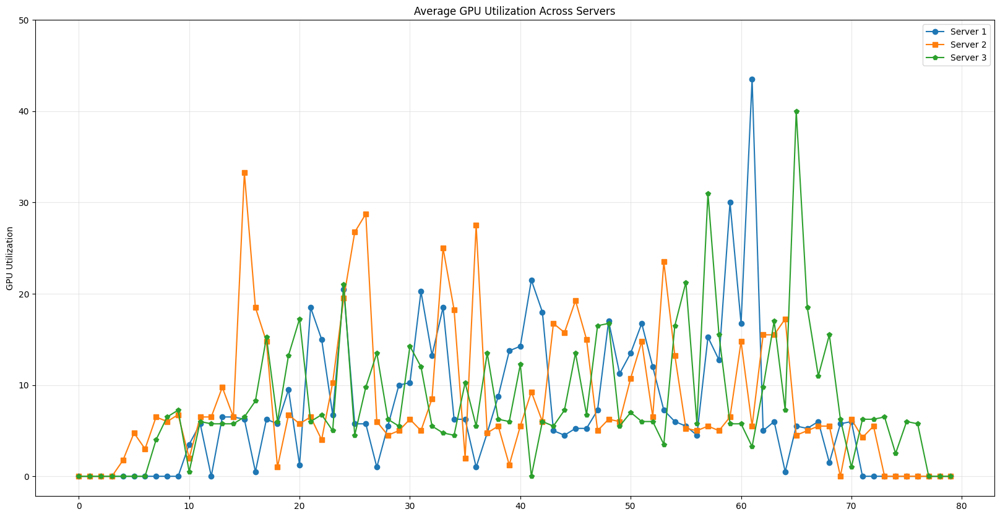

---

### RR + TensorFlow

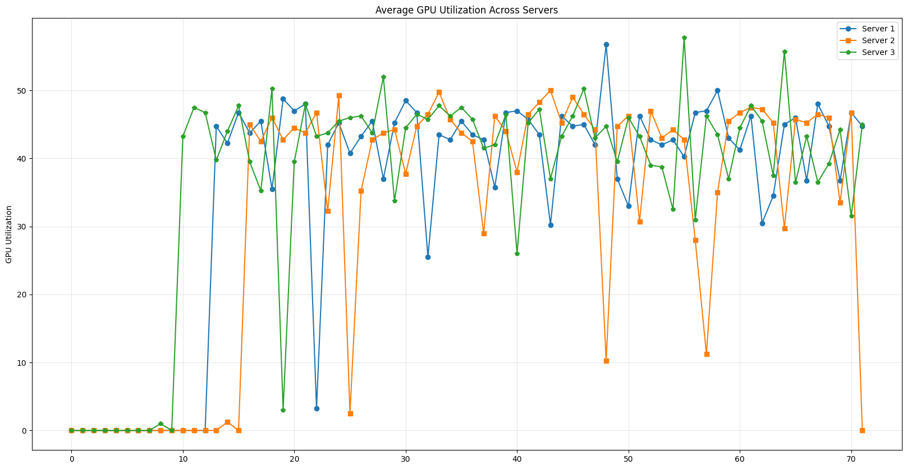

---

### RR + Apache MXNet

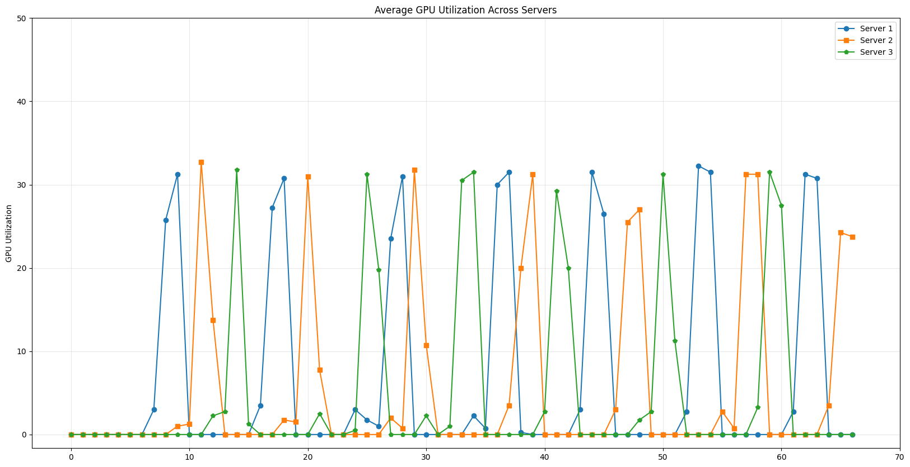

---

### Speedup of Pre-Trained Models

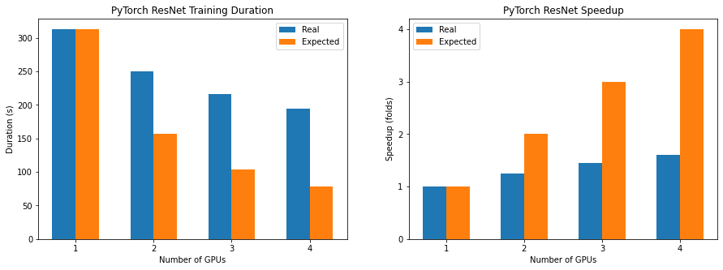

---

### Scalability of Pre-Trained Models

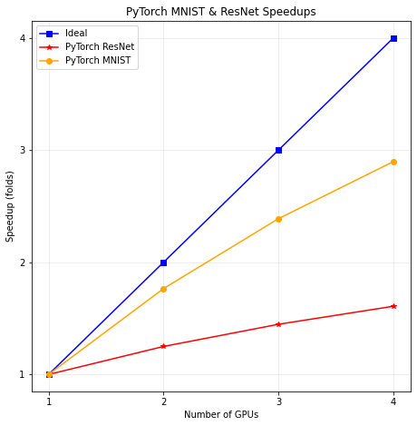

---

# Conclusion

1. FIFO maximizes GPU utilization for each server.
2. Round Robin minimizes GPU utilization for each server.
3. Smaller jobs gain more speedup, while not larger jobs.
4. Job migrations help ensure job completion and stabilize the average turnaround time.

---

# Future Work

---

#### Future Work 

More Scheduling Algorithms

* Shortest-Remaining-Job-First (SRJF)
* Shortest-Remaining-Time-First (SRTF)
* Earliest-Deadline-First (EDF)
* Tiresias
* FfDL
* AFS-L

---

#### Future Work 

A better queuing system

---

#### Future Work

A better training time estimator

* Available resources
* No. of jobs
* Jobs' hyperparameters
* Resource requirements