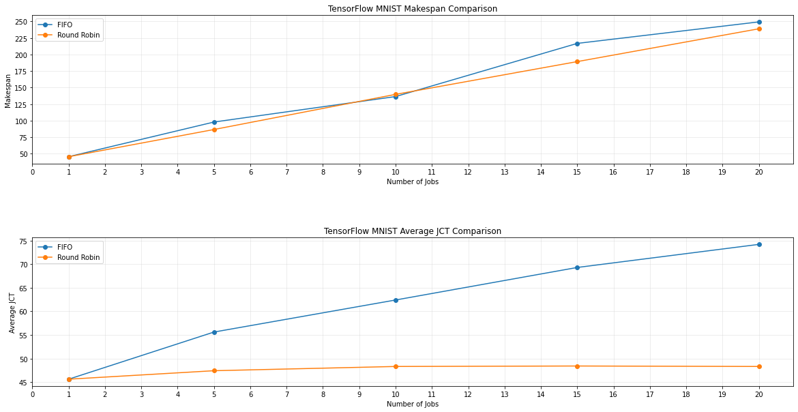
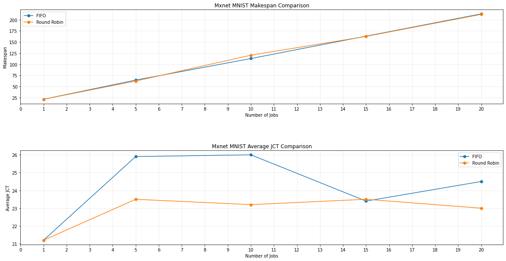
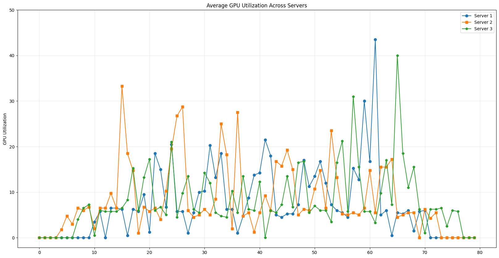
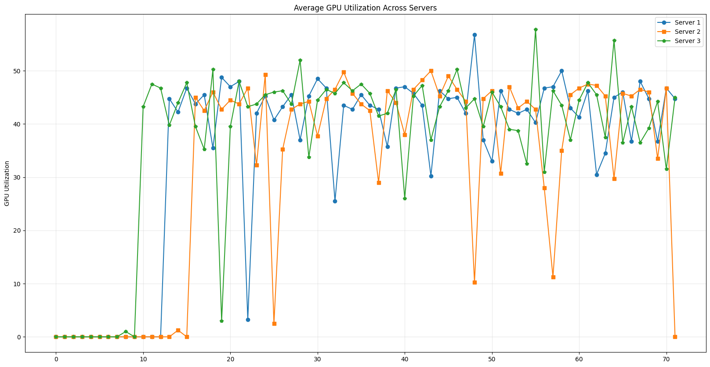
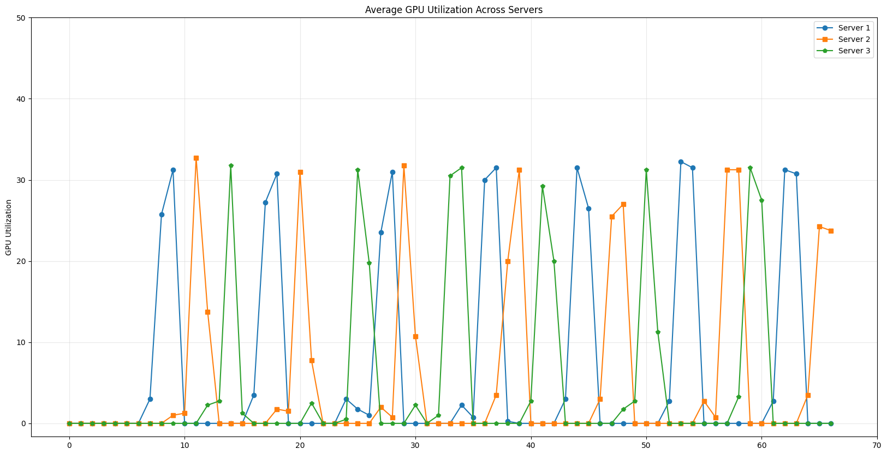

# Abstract

<!-- 
The abstract should have 500 words, and it should consist the following elements:
1. 25% of their space on the purpose and importance of the research (Introduction)
2. 25% of their space on what you did (Methods)
3. 35% of their space on what you found (Results)
4. 15% of their space on the implications of the research (Discussion) 
-->

In this dissertation, we will propose a novel method to a distributed deep learning system that permits users to train their model using several computational graphics cards. This system offers customizable scheduling algorithms, and users can alter the scheduling algorithm without having to restart the system. Compared to existing distributed deep learning systems, our system is lightweight and considerably simpler to install on any machines that have computational graphics cards. Furthermore, we will develop two scheduling algorithms to demonstrate the flexibility of our system, and how they affect the average makespan and turnaround time of models made with distinct deep learning frameworks.

To create this lightweight distributed deep learning system, we carefully chose the tools required to create this system to avoid a parsimonious design. In order to keep the simplicity of the system, we chose easy-to-use and proven technologies that stood the test of time. 

Since the system consists of different microservices, we found that it is easy to make changes and any changes made will not affect the entire system. Not only minor or major customizations can be made easily to the system, but the users can determine the scheduling algorithm that best suits their needs without having to restart the entire system. Moreover each scheduling algorithm have different effects on the average makespan and turnaround time of models. We found that FIFO maintains maximal resource utilization, while Round Robin reduces the average makespan of some models.

With this project, we hope to provide a lightweight distributed deep learning system that is easy to install and use, especially for those who are new to deep learning so that they can focus more on developing models instead of troubleshooting system fault. Also, we hope to enable incremental changes to the system, and to provide a system that is flexible enough to be customized to the needs of the users. 

# 1. Introduction

Deep learning is one of the artificial intelligence field that focuses on neural networks with representational learning, and it has been one of the sought-after fields in the research community. Due to the deep learning algorithms efficiency in inferring information, a great number of researchers from different fields has been using Deep Learning to help them automating tasks in numerous fields. In natural language processing, a vast number of natural language processing systems are capable of conversing like humans in numerous languages since those models are trained on pre-trained language models with gazillion of parameters such as BERT, ALBERT, RoBERTa, and Megatron-LM. In computer vision, pre-trained models such as ImageNet, VGG16, ResNet, Inception, and EfficientNet,  have been used to extract features and use them for a variety of tasks from perceptual resemblance, image classification, semantic segmentation, and object detection. Other fields also show similar fashion namely bioinformatics, reinforcement learning, and speech processing and recognition.

Due to the sheer size and the staggering number of parameters of these models, training these models can be a daunting task. In order to train these models, researchers and practitioners need to have access to a large number of computational resources. However, not all researchers and practitioners are capable to maximize all the computing resources available. In order to address this issue, researchers have proposed several distributed deep learning systems that can be used to train these models. However, these systems are either too complex to install and use, or they are too rigid to be customized to the needs of the users.

In 2018, two engineers from Uber Technologies made a framework that capable of solving the aforementioned issue. They proposed a method that allows models to be trained parallely with one or more graphic cards.

Even though a model can be trained with multiple graphic cards, users still have to manually consider the amount of resources each model requires. Most of the time, users will over or under estimate the amount of resources needed to train a model. 

In this thesis, I will be proposing a system that schedules deep learning models with fixed or dynamic amount resources to any available machines. Most importantly, it enables users to train deep learning models with one or more graphic cards. Since this framework is made to schedule deep learning models, thus it is called Schedulearn.

# 2. Background

In this chapter, we will be discussing the issues that Schedulearn is trying to solve, as well as the tools that are used to solve the underlying issues and the related works.

## 2.1. Motivation

Before Schedulearn was developed, we had been using and developing features on Vodascheduler. However, we had encountered three main challenges.

First, Vodascheduler is made on top of Kubeflow, thus it uses Kubernetes as the container orchestration tool. However, Kubernetes requires users to have wide range of knowledge, and thus it is not suitable for developing prototypes. Moreover, developers with litle or no knowledge of Kubernetes will have a hard time to comprehend the big picture of the system.

Besides that, it is hard to setup Vodascheduler since Kubernetes needs to be installed in each machine. After Kubernetes is installed, users need to create a Kubernetes cluster and install Kubeflow in the cluster. Before they even get to install Kubeflow in each node, they still need to install several third party framework such as Helm and NVIDIA GPU Operator. This is not suitable for users who just want to try out the system. In addition to that, it takes at least 3 minutes just for the system to run properly without throwing any errors. The reason is the system depends heavily on MongoDB which requires some time to start up. Not only MongoDB does take some time to start up, MongoDB docker image is also quite big, and it requires at least 500 MB of storage just to keep MongoDB running with an empty database.

In addition to those issues, users have to go through tedious steps to run their models. Before uploading models to Vodascheduler, users are required to write their own Docker files, and upload their customized Docker files to Docker Hub. Then, users need to write a YAML file to specify the Docker image and how much resources that their models need, as well as the commands that need to be run in the pod. To most users, these steps are tedious and time consuming, and users can not focus on developing their models.

Lastly, it takes a huge amount of time maintaining Vodascheduler. The reason is any changes made, the whole system needs to be restarted for the changes to take effect. Thus, the maintainers of Vodascheduler would have to restart the system several times a day, and it would accumulate to several hours a week.

## 2.1. Tools

Schedulearn is made with a microservice architecture as the blueprint. A microservice architecture is an architectural style that structures an application as a collection of loosely coupled services. Each service is a small, independent process that communicates with other processes to achieve a business goal. The microservice architecture is a style of software design that emphasizes building single-purpose services that are independently deployable, scalable, and replaceable. By decomposing Schedulearn into small, independent services, we can build and deploy each service independently. This allows us to scale each service independently. Moreover, it also allows us to add and replace a service easily without affecting other services. In the following subsections, we will be discussing the tools required to create Schedulearn.

### 2.1.1. Containerization 

Containerization is a form of virtualization where applications run in isolated user spaces, called containers, while using the same shared operating system (OS). A container is a standard unit of software that packages up code and all its dependencies so the application runs quickly and reliably from one computing environment to another, and it also consumes less resources than virtual machines because all of the containers share the same operating system kernel's services. One of the benefits of containerization is that a container is essentially a fully packaged and portable computing environment, meaning that it can be easily moved from one machine to another. In addition to that containers are isolated from one another and the software, libraries and configurations are not shared between them. This means that if one container is compromised, the other containers are not affected.

Containers are made from container images. A container image is a lightweight, standalone, executable package of software that includes everything needed to run an application: code, runtime, system tools, system libraries and settings. These images can be acquired from the docker hub or can be built from scratch per the user's needs.

### 2.1.2. Distributed Deep Learning

Distributed deep learning is a technique that allows deep learning models to be trained with multiple machines and computational graphic cards. There are mainly two types of distributed deep learning techniques: model parallelism and data parallelism.


Horovod is a distributed training framework for TensorFlow, Keras, PyTorc, and Apache MXNet. Uber introduced it in 2017, just a month after launching Michelangelo, an internal machine learning-as-a-service platform to build and deploy systems at scale. 

The main objective of Horovod is to make distributed Deep Learning fast and easy to use. With the help of the ring-allreduce approach, Horovod is able to achieve high bandwidth between nodes and to scale up to thousands of GPUs and to efficiently run a variety of workloads, including image classification, natural language processing, and reinforcement learning. Hence, Horovod brings down the model training time to hours from days or weeks. Besides that, Horovod can scale up an existing training script to run on hundreds of GPUs in just a few lines of Python code.

Distributed Training is a technique that allows users to speed up training processes using multiple computational graphic cards.  


### 2.1.3. Web Services

Representational State Transfer, or REST, was first introduced by Roy Fielding in his doctoral dissertation in 2000. REST is what is known as an architectural style, which is a way of designing software systems. REST is a style of software architecture for distributed hypermedia systems such as the World Wide Web. REST is an approach to communications that is often used in the development of Web services. 

Web service is a software system designed to support interoperable machine-to-machine interaction over a network. It has an interface described in a machine-processable format (specifically WSDL). Other systems interact with the web service in a manner prescribed by its description using SOAP-messages, typically conveyed using HTTP with an XML serialization in conjunction with other web-related standards.

REST-compliant Web services, often called RESTful Web services, provide interoperability between computer systems on the Internet making it easier for systems to communicate with each other. RESTful Web services allow the requesting systems to access and manipulate textual representations of Web resources by using a uniform and predefined set of stateless operations. Other kinds of Web services, such as SOAP Web services, expose their own arbitrary sets of operations.

### 2.1.4. Relational Database

Relational database is a type of database that stores and provides access to data points that are related to one another. Relational databases are based on the relational model, an intuitive, straightforward way of representing data in tables. In a relational database, each row in the table is a record with a unique ID called the key. The columns of the table hold attributes of the data, and each record usually has a value for each attribute, making it easy to establish the relationships among data points. A system of relational databases, with the same schema, is called a relational database management system (RDBMS).

One example of a relational database is SQLite. SQLite is a relational database management system contained in a C library. In contrast to many other database management systems, SQLite is not a client-server database engine. Rather, it is embedded into the end program. SQLite complies with ACID which stands Atomicity, Consistency, Isolation, and Durability. Due to its compliance with ACID, SQLite guarantees that database transactions are processed reliably and consistently regardless of errors, power failures, or other mishaps.

# 3. Related Works


# 4. Design and Implementation

In this chapter, we will be discussing the design and implementation of Schedulearn. We will be discussing the design of the system, the implementation of the system, and the testing of the system.

## 4.1. Implementation

Schedulearn is created due to the frustrations that we have experienced when we were trying to train our models with VodaScheduler, as well as developing new features in it. In the following paragraphs, we will elaborate how Schedulearn overcomes the issues mentioned in the background section.

As for the programming language to develop the Schedulearn API, we chose Python as the main language to avoid the verbosity of Golang while developing new features for VodaScheduler. Even though Golang has been been praised due to its computation and compilation speed, its verbosity hinders developers from developing new features in a short period of time. However, developing features in Python is relatively faster than Golang since Python allows us to develop multiple significant due to its simplicity and the abundance of third party frameworks. As a result, Python seems to be a suitable language for developing prototypes, such as Schedulearn.

The reason FastAPI becomes the framework of choice is that it is a web framework for Python, and it allows concurrency as well. Since FastAPI is capable of concurrency, it allows the training jobs to be run in the background so the incoming job requests will not be blocked. Moreover, FastAPI also allows us to create a RESTful API, which is the main purpose of Schedulearn.

To address the complexities caused by Kubernetes, Schedulearn uses Docker to orchestrate the training jobs. In this project, Docker containers are easy to manipulate. Since Schedulearn is written in Python, it uses Python's Docker API. With that, docker containers can be created, paused, and deleted programmatically easily with Python. As a result, less prerequisite knowledge is required to setup Schedulearn.

To create a container containing a training job with multiple graphic cards, users only needs a few lines of Python codes below. 

```python
import docker 
client = docker.from_env()

user_command = "python tensorflow2/tensorflow2_keras_mnist.py"

container = docker_client.containers.run(
    name = "Keras MNIST",
    image = "horovod/horovod:latest", 
    command = f"horovodrun -np 2 -H localhost:2 {user_command}",
    shm_size = "1G",
    detach = True,
    environment = {
        "NVIDIA_VISIBLE_DEVICES": "0,1",
    }
)
```

The reason that the shared memory, or `shm_size` in this case, is set to 1 GB is to avoid the error that occurs when the shared memory is too small, and the default shared memory is 128 MB. This error happens due to the fact that the shared memory is too small to store the data that is being shared between GPUs. In the worst case, the container will be terminated immediately.

The other thing worth mentioning is that the system will specify what GPUs to use by setting the `NVIDIA_VISIBLE_DEVICES` environment variable. This variable is used to specify which graphic cards are visible to the container. This can be used to guarantee that the container will only use as many as graphic cards that are assigned by the scheduler.

As for the database, Schedulearn uses the SQLite database which Python's built-in database and data retrieval is fast. Moreover, SQLite does not require any docker containers to run since all data is stored in a single file. The database file is only 32 Kb in size and is also portable. Meaning that the database file can be copied from one server to another to guarantee the integrity of the data.


## 4.2. System Overview


The figure above shows that ther are 4 significant components of Schedulearn. 

1. The user interface is the component that allows users to interact with Schedulearn, such as submitting and deleting jobs, as well as showing training's output. The user interface is a web application that is written in TypeScript and is built on top of Next.js. 

2. The database is the component that stores all metadata of training jobs. The database is a SQLite file and only requires a few kilobytes. 

3. The server consists of three machines, and each machine has four graphic cards. The server is the component that runs the training jobs. 

4. The Schedulearn API is written in Python and built on top of FastAPI. It is responsible for handling all training requests from the user interface and regulating the server's GPU resources. Simply said, the Schedulearn API is the brain of the entire system.

## 4.3. Model Submission


The figure above shows there are seven steps of dispatching a Deep Learning model to the system. Namely:

1. Users inputs the model's name, image, container's commands, and the number of graphic cards that a model needs on the user interface shown in Figure \ref{fig:Job Form}. Once the information is submitted, then the user interface will wrap those details into a JavaScript Object Notation, or JSON, file and send it to the API.
2. The Schedulearn API will select which server that has the required resources.
3. The API will save a new entry and save the data regarding the model in the database.
4. The database will return the newly created entry to the API for future usage.
5. A new container will be created with the specified name and image. Once the container is created, the specified user commands will be executed inside the container in order to commence the training process. This container will run in the background so it will not block any other incoming training requests.
6. Once the training is over, then the container will notify the API and save the output in the database.
7. While the training is ongoing, the API will stream out the training's output to the user interface at the same time shown in the figure below.


## 4.4. Scheduling Algorithm 

After a model has been dispatched from the user interface to the API, the API will take over from here to determine where the model should be placed. There will be two scheduling algorithms used to assign training models. The first one is a customized version of the First-In-First-Out algorithm, and the other is the Round Robin algorithm.

### 4.4.1. FIFO

FIFO is an acronym for "First In, First Out". It is an abstraction on how to manage and manupulate data based on time and the priority of the data. FIFO is a technique used in the computer science field manage data that reside in queues. Here is the advantages of FIFO:
1. The algorithm is simple and easy to understand, and universally applicable.
2. FIFO follows the natural flow of data, where the oldest job will be executed first and the newest job will be executed last.
3. It's easy to assign priorities to data since data is prioritized based on the time it is created.

Let $G$ to be an empty set of available GPUs, and $R$ be the number of required GPUs. We then iterate through each machine in the server. In each machine, iterate through graphical processing units. If a GPU has an utilization of less than 90%, then append this particular GPU to $G$. After iterating all the GPUs that reside in all machines, we then check the number of elements in $G$. If the number of element in $G$ is greater than $R$, then return it.

### 4.4.2. Round Robin

Round Robin is a scheduling algorithm that is used to assign tasks to multiple resources. In this case, the resources are the servers, and the tasks are the training jobs. The algorithm works by assigning each server a turn to run a training job. Schedulearn will keep track of the last assigned server. When a new training job is submitted, Schedulearn will assign the job to the next server in the list. If the last assigned server is the last server in the list, then the next server will be the first server in the list. This process will continue until there no training jobs in the queue. Round Robin is used often in the real world, such as in the operating system, and in the networking world.

Here is the advantages of Round Robin:
1. Fairness is guaranteed since each training job gets equal amount of resources.
2. Jobs will spend less time waiting.
3. Since jobs will spend less time waiting, the average turnaround time will be reduced.

## 4.5. Advantages

### 4.5.1. Easy Setup

To operate Schedulearn, administrators do not need to install and setup orchestration tools like Kubernetes, which takes hours or even days to setup depending on users. These are the tools required for Schedulearn to run seamlessly.

1. Node Version Manager (NVM) - To install different versions of Node.js
2. Next.js - To build the user interface
3. Anaconda - To create isolated environments, install Python, and required dependencies
4. FastAPI - To build the API
5. Docker - To create containers

### 4.5.2. Easy Job Submission

Deploying a Deep Learning training job is as easy as sending JSON files on the internet. It is to ensure that users can focus more on developing faster and more efficient Deep Learning models. The JSON file only contains five keys with five corresponding values.

In addition to that, users do not even need to setup an isolated environment for Horovod since setting it up require much more knowledge and expertise. Thus, users can utilize the Horovod pre-built image made by Uber itself, or users can even customize the Horovod pre-build image so that the image can suit their needs. 

### 4.5.3. Multiple Scheduling Algorithms

Users are capable of choosing between multiple scheduling algorithms running on Schedulearn. This mechanism allows users to choose the scheduling algorithm that best suits their needs. Users can even create their own scheduling algorithms and run it on Schedulearn. In addition to that, the scheduling algorithms are written in Python, which means that users can easily create their own scheduling algorithms without having to learn a new programming language.

Most importantly, changing between scheduling algorithms does not require any downtime. Users can change the scheduling algorithm at any time without having to restart the Schedulearn API.

### 4.5.4. Lightweight

Schedulearn is lightweight and does not require much resources to run. The user interface is built on top of Next.js, which is a lightweight framework that is built on top of React. The API is built on top of FastAPI, which is a lightweight framework that is built on top of Python's ASGI server, Starlette. The database is SQLite, which is a lightweight database that is built on top of Python's built-in database.

In addition to SQLite being lightweight, it is also portable. This means that the database file can be copied from one server to another to guarantee the integrity of the data.

# 5. Experimentation

<!-- train on mnist dataset -->

In this experiment, we will compare three different deep learning frameworks, namely TensorFlow, PyTorch, and MXNet, on how the number of GPUs and scheduling algorithms affect their makespan and turnaround time. We will be using a MNIST dataset, which is a dataset of handwritten digits. The dataset contains 60,000 training images and 10,000 testing images. Each image is a 28x28 grayscale image. The dataset is split into 50,000 training images and 10,000 testing images. The training images are further split into 50,000 training images and 10,000 validation images.

## 5.1. Experiment Setup

The performance of Schedulearn is evaluated on a system consisting three servers. Each server are equipped with hardware, namely:

1. Four Nvidia GTX 1080 Ti graphical processing units, each equipped with 11GB Video Random Access Memory (VRAM)
2. Intel Xeon E5-2678 v3 with 48 cores running at 2.50GHz
3. 128 GB Random Access Memory (RAM)
4. 10G PCIe NIC network card

## 5.2. Training Speedup


In the figure above, there are two columns of figures. The left column shows the time that each model required to complete, and the right column shows the training speedup on Schedulearn. The training speedup is calculated by dividing the training time of a single GPU by the training time of multiple GPUs. Speedups will be represented in folds.

In the first row, a TensorFlow model is trained on a MNIST dataset from the Keras library. With a single GPU, the training time is 107 seconds. With two GPUs, the training time is 69 seconds, and the speedup is 1.5 folds. The model is then trained on three GPUs, and the training time is about 52.3 seconds, and the speedup is about 2 folds. The model is then trained on four GPUs, and the training time is reduced to 45 seconds, and the speedup is 2.16 folds.

In the second row, a TensorFlow model is trained on a MNIST dataset from the TensorFlow library itself. With one GPU, the model managed to finish in almost about 67 seconds. With two GPUs, the time completion is 51 seconds, and the speedup is 1.3 folds. With three GPUs, the model finished in above 42 seconds, and the speedup is 1.6 folds. With four GPUs, the model finished in about 37 seconds, and the speedup is 1.8 folds.

In the third row, a PyTorch model is trained on a MNIST dataset. With one GPU, the model finished in 157 seconds. With two GPUs, the model finished in 89 seconds, and the training speedup is 1.76 folds. With three GPUs, the model finished in 66 seconds, and the training speedup is 2.3 folds. With four GPUs, the model finished in 54 seconds, and the training speedup is close 3 folds.

In the fourth row, a MxNet model is trained on a MNIST dataset. With one GPU, the model finished in 28.6 seconds. With two GPUs, the model finished in 24.3 seconds, and the training speedup is 1.18 folds. With three GPUs, the model finished in 22.2 seconds, and the training speedup is 1.3 folds. With four GPUs, the model finished in 21.5 seconds, and the training speedup is 1.34 folds.

## 5.3. Scalability

We can combined the graphs in the second column in the figure above into a more descriptive graph to compare the scalability of each model trained on Schedulearn. Note that a speedup is calculated by dividing the training time of a single GPU by the training time of multiple GPUs. From models' speedups, we can infer the scalability of each model. The higher the speedups of a model, the higher its scalability. Thus, models that have higher speedups are more scalable than models that have lower speedups, and the probability of that model to complete faster given more GPUs is higher.

In the figure below, there are five lines. Each line represents the scalability of a model. The x-axis represents the number of GPUs, and the y-axis represents the speedups in folds. The blue line represents the expected scalability when the number of GPUs is increased. The orange line represents the scalability of a PyTorch model. The red line represents the scalability of a TensorFlow model trained on a MNIST Keras dataset. The green line represents the scalability of a TensorFlow model trained on a MNIST TensorFlow dataset. The purple line represents the scalability of a MxNet model trained on a MNIST dataset.

PyTorch sits at the top of the graph, which means that it is the most scalable model. The scalability of PyTorch is expected to increase as the number of GPUs increases as the line is close to the blue line. The scalability of the TensorFlow model trained on a MNIST Keras dataset is positioned at the middle of the graph, which means that it does not improve the speedups significantly. However, the scalability of the TensorFlow model trained on a MNIST TensorFlow dataset and the MxNet model trained on a MNIST dataset are almost the same, and they are positioned close to the bottom of the graph. This means that the scalability of these two models are considered low.


## 5.4 Comparison

In this experiment, we will compare the performance of Schedulearn with two scheduling algorithms: FIFO and Round Robin.  In order to do so, we will use two metrics namely the average makespan and turnaround of each job. Makespan is the time that it takes for the last job to complete. While turnaround is the time that it takes for a job to complete. 


In the figure above, it shows how jobs are submitted to the scheduler. There are four strategy in total. The first strategy is to submit five jobs every ten seconds. The second strategy is to submit ten jobs every ten seconds. The third strategy is to submit fifteen jobs every ten seconds. The fourth strategy is to submit twenry jobs every 10 seconds.

### 5.4.1. Job Makespan and Turnaround

In this part, we will show how each scheduling algorithm affects the average makespan and turnaround of training jobs. There are three figures where each figure represents the effect of each scheduling algorithm on multiple models made with different Deep Learning frameworks. The first graph represents the effect of FIFO and Round Robin on the average makespan, and the other on the average turnaround. The x-axis represents the number of jobs, and the y-axis represents the average makespan or average turnaround.

In the first figure, we can see that the average makespan and average turnaround of PyTorch MNIST decreases as the number of jobs increases while being scheduled with Round Robin. The average makespan and turnaround on five jobs are about the same between two schedulers. However, the average makespan decreased by 21% and the average turnaround decreased by 11% when the number of jobs increased to ten. The average makespan decreased by 10%, but the average turnaround increased by 11% when the number of jobs increased to fifteen. Eventually, the average makespan decreased by 23% and the average turnaround decreased by 11% when the number of jobs increased to twenty.


In the second figure, we can see that the average makespan of TensorFlow MNIST models scheduled Round Robin decreased by small margins. The average makespan of two schedulers on five jobs decreased by 11%. However, the average makespan of Round Robin increased by 2% when the number of jobs increased to ten. The average makespan of Round Robin decreased significantly by 12% when the number of jobs increased to fifteen. Eventually, the average makespan of Round Robin decreased by mere 4% when the number of jobs increased to twenty.

In the second figure, we can see that the average makespan of TensorFlow MNIST models scheduled with Round Robin stays low even though the number of jobs keeps increasing. The average turnaround decreased by 14% when those ten jobs scheduled with Round Robin. This trend continued when the number of jobs increased from ten to twenty. With Round Robin, the average turnaround decreased by 22%, 30%, and 34% when the number of jobs increased to fifteen, twenty, and twenty-five, respectively.



In the third figure, we can see that the average makespan of MxNet MNIST models scheduled with FIFO and Robin Hood are almost the same. Similar to TensorFlow MNIST models scheduled with Round Robin, the average turnaround of MxNet MNIST models scheduled with Round Robin is significantly lower than the average turnaround of MxNet MNIST models scheduled with FIFO. The average turnaround of MxNet MNIST models scheduled with Round Robin decreased by 9% when the number of jobs increased to five. When the number of jobs increased to ten, the average turnaround of MxNet MNIST models scheduled with Round Robin decreased by 10%. The average turnaround of MxNet MNIST models scheduled with Round Robin increased so little that it is almost negligible when the number of jobs increased to fifteen. Eventually, the average turnaround of MxNet MNIST models scheduled with Round Robin decreased by 6% when the number of jobs increased to twenty.

Moreover, the average makespan of TensorFlow MNIST models scheduled with Round Robin stays low even though the number of jobs keeps increasing. The average turnaround decreased by 14% when those ten jobs. This trend continued when the number of jobs increased from ten to twenty. The average turnaround decreased by 22%, 30%, and 34% when the number of jobs increased to fifteen, twenty, and twenty-five, respectively.



### 5.4.2. GPU Utilization

The first three graphs shows the the average GPU utilization of each server when the jobs are scheduled with FIFO. The x-axis represents the time in seconds, and the y-axis represents the average GPU utilization.

The first graph illustrates the average GPU utilization of servers that runs PyTorch MNIST models. The GPU utilization of the first server increased over time as the time goes, and reached its peak at 90% after 40 seconds. The GPU utilization of the second server only started to increase after 30 seconds, and only reached 50% as soon as the GPU utilization of the first server almost reached its peak. However, the GPU utilization of the third server stays low throughout the experiment. 

The second graph illustrates the average GPU utilization of servers that runs TensorFlow MNIST models, and the GPU utilization of all servers fluctuated regularly over time. The three lines, that indicates the GPU utilization of each server, are almost identical to each other since they follow a mountain-like pattern. When the GPU utilization of one server increases and peaks at about 95% for a while, the GPU utilization of another server will increase and peak for a while. This pattern continued until the end of the experiment. 

The third graph illustrates the average GPU utilization of servers that runs Apache MXNet MNIST models. Only the utilization of the first server fluctuated regularly overtime and peaks at around 80% for about five seconds, while the other two servers were idle.  

Simply said, the average GPU utilization across servers is always high when the jobs are scheduled with FIFO. Thus, the FIFO scheduling algorithm is preferable if the goal is to maximize the GPU utilization.


The second three graphs also comprises of the graphics cards utilization across different servers with the same x-axis and y-axis representations, however scheduled using Round Robin. 

The first graph illustrates the average of GPU utilization of servers that runs PyTorch MNIST models, and the utilization across all servers seems to be more balanced than the utilization when jobs are scheduled with FIFO. The lines stayed at range of 5% to 30% throughout the experiment, and only peaks around above 30% for a few seconds then drops back to the range of 5% to 30% immediately.

The second graph illustrates the average of GPU utilization of servers that runs TensorFlow MNIST models, and the utilization across all servers are also balanced since the lines stay at range of 30% to 50% throughout the experiment. At some points, the GPU utilization of one server dropped dramatically, but it immediately increased again to the range of 30% to 50%.

The third graph illustrates the average of GPU utilization of servers that runs Apache MXNet MNIST models, and the lines follows a more rhythmic pattern. The utilization of all servers stays around 0% to 30% throughout the experiment.

Simply said, the average GPU utilization across servers is always under 50% when the jobs are scheduled with Round Robin. Thus, the Round Robin scheduling algorithm is preferable if the goal is to minimize the GPU utilization.





### 5.4.3. Scheduling Pre-Trained Models

<!-- PyTorch ResNet -->

In this part, we will be scheduling one of the pre-trained models called PyTorch ResNet. We will be scheduling training jobs of this model scheduled both with FIFO and Round Robin, and see how the average makespan and turnaround are affected by these two approaches. 

In the figure below, it consists of two graphs which the first graph shows the real and expected turnarounds, and the second pictures illustrates the average turnaround of PyTorch ResNet models. The x-axis in the first graph represent the number of GPUs, and the y-axis represents the turnaround time in the first graph and the speedup in the second graph.

In the first graph, a PyTorch ResNet model with one GPU requires at least 312.9 seconds to complete. While with two GPUs, it requires 250.4 seconds where it's expected to complete in 156.4 seconds. With three GPUs, it requires 216.2 seconds where it's expected to complete in 104.3 seconds. With four GPUs, it requires 194.6 seconds where it's expected to complete in 78.2 seconds.


In the second figure below, it illustrates the ideal, PyTorch MNIST, and PyTorch ResNet speedups. The x-axis represents the number of GPUs, and the y-axis represents the speedup. The goal of this figure is to show how the speedup of a larger model, like PyTorch ResNet, compares to the ideal speedup and the speedup of a smaller model, like PyTorch MNIST.

We can see that assigning more GPUs to larger training models like PyTorch ResNet will not necessarily increase the speedup significantly. In fact, the speedup stays below two folds even thought it's assigned four GPUs. Unlike a PyTorch MNIST model, which is relatively small, assigning it more GPUs will increase the speedup closer to three folds.


We also compared the average makespan and turnaround of PyTorch ResNet models scheduled with FIFO and Round Robin. For the experiment, we sent a total of three PyTorch ResNet training requests with two minutes span. With FIFO, the average makespan is 574.5 seconds, and the average turnaround is 326.9 seconds. With Round Robin, the average makespan is 448.0 seconds, and the average turnaround is 209.9 seconds. 

# 6. Conclusion

In this paper we introduced Schedulearn, a lightweight distributed deep learning system that can be used to schedule deep learning jobs on a cluster of machines, and it is built with only with Docker and FastAPI. It is easy to set up so that users can focus more on developing models instead of setting up environments. With the help of Horovod, it supports four different kinds of Deep Learning frameworks, such as PyTorch, TensorFlow, MxNet, and Keras. Also, it's designed to be extensible so that users can include new features and algorithms in the system in a plug-and-play fashion. One example of that is users can change scheduling algorithm from one to another without having to restart the system, and this can be done easily just by sending a request to the system. 

In the experiment, we have experimented on two different scheduling algorithms to see how these algorithms help the machines utilize resources effectively. We found that Round Robin helps the machines minimize the turnaround time and not overloading the machines by distributing the jobs evenly across the machines. While FIFO helps the machines to maximize the utilization of resources by assigning jobs to the machines that are available first, and the downside of FIFO is that it can cause the machines to be overloaded and the turnaround time to be longer.

Our experiment also shows that it is more efficient to schedule smaller models instead of larger model with more GPUs. This is because the larger models, such as PyTorch ResNet, gain less than two times speedup even with four GPUs. However, the smaller models, such as PyTorch MNIST, gain close to three times speedup when it's assigned four GPUs.

# 7. Future Work

Due to time constraints, numerous modifications, testing, and experiments have to be limited. Since this thesis has been mainly focused on a system that schedules deep learning jobs, there are many other features that can be added to the system. For example, the system can be extended to feature better queueing measures and to support other types of scheduling algorithms as well. The following concepts could be investigated and put into practise in the future:
1. **Support for more of scheduling algorithms:** The system can be extended to support other types of scheduling algorithms, such as SRJF (Shortest Remaining Job First), SRTF (Shortest Remaining Time First), EDF (Earliest Deadline First), Tiresias, FfDL, and AFS-L.
2. **Support for job migration:** The system can be extended to support job migration, which is a technique that allows jobs to be migrated from one machine to another machine. This technique can be used to reduce the turnaround time of jobs.
3. **Support for a better queueing measure:** The system can be extended to support a better queueing measure so that the system can prioritize jobs that are more important than others. This technique can be used to reduce the makespan of jobs.
4. **Support for a better resource utilization usage prediction:** The system can be extended to support a better resource utilization measure so that the system can support more complex scheduling algorithms and account the resource utilization of the machines. This technique can be used to reduce the makespan and the turnaround time of jobs.
5. **Support for estimating the job turnaround time in real time:**
The system can be extended to support a deep learning model that estimates the job turnaround time in real time based on the resource utilization across machines, number of jobs in queue, and each job's hyperparameter and resource requirements. This technique is already implented in UberEats' system.